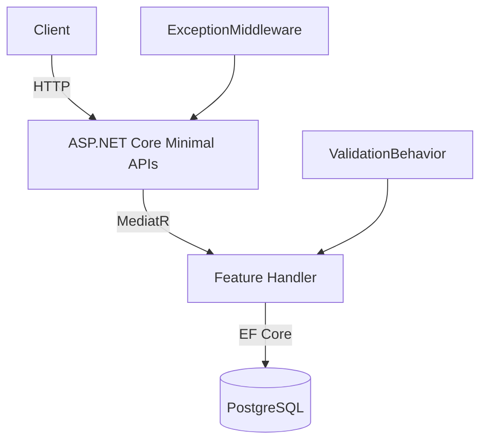

# TaskFlow API


Task management REST API built with **Vertical Slice Architecture** + **CQRS** + **MediatR** in .NET 10.

> Part of a .NET portfolio series. Tutorial: [YouTube Series](#) | [LinkedIn](#)

## Architecture

Each feature is a self-contained vertical slice with its own endpoint, handler, validator, and query — no shared application layer.



## Quick Start

Prerequisites: Docker Desktop

```bash
git clone https://github.com/elsaldagaster-stack/dotnet-vertical-slice-api
cd dotnet-vertical-slice-api
docker compose up -d
```

API available at: `http://localhost:8080`  
API docs (Scalar): `http://localhost:8080/scalar/v1`  
Logs (Seq): `http://localhost:8081`

## Key Endpoints

| Method | Route | Description |
|--------|-------|-------------|
| POST | `/api/users` | Register user |
| POST | `/api/projects` | Create project |
| GET | `/api/projects` | List projects (cursor pagination) |
| POST | `/api/projects/{id}/issues` | Create issue |
| GET | `/api/projects/{id}/issues` | List issues (filters: status, priority, assignee) |
| PATCH | `/api/issues/{id}/status` | Transition issue status |
| PATCH | `/api/issues/{id}/assign` | Assign issue to user |
| POST | `/api/issues/{id}/comments` | Add comment |

## Domain Rules

Issue status transitions:
```
Backlog → InProgress → InReview → Done → Closed
              ↑___________|
```
- Closing an issue requires an assignee
- `Closed` is a final state — no transitions out

## Project Structure

```
Features/
├── Users/
│   ├── RegisterUser/  ← Command + Handler + Validator + Endpoint
│   └── GetUsers/      ← Query + Handler + Endpoint
├── Projects/
│   ├── CreateProject/
│   ├── GetProjects/   ← cursor pagination + search
│   └── ...
├── Issues/
│   ├── TransitionIssueStatus/  ← domain rules enforced
│   ├── AssignIssue/
│   └── ...
└── Comments/
```

Each slice owns everything it needs. No shared application layer.

## Local Development

Start only the database:

```bash
docker compose up postgres -d
```

Run the API — migrations apply automatically on startup:

```bash
dotnet run --project src/TaskFlow.Api
```

API available at: `https://localhost:5001`  
API docs (Scalar): `https://localhost:5001/scalar/v1`

## Running Tests

```bash
dotnet test tests/TaskFlow.IntegrationTests
```

Tests use Testcontainers — real PostgreSQL, no mocks. No manual database setup needed.

## Tech Stack

| Concern | Tool |
|---------|------|
| Framework | .NET 10 / ASP.NET Core Minimal APIs |
| CQRS | MediatR 12 |
| Validation | FluentValidation 11 |
| Database | EF Core 9 + Npgsql + PostgreSQL 16 |
| Testing | xUnit + Testcontainers + FluentAssertions |
| Logging | Serilog + Seq |
| API Docs | Scalar (OpenAPI) |
| CI | GitHub Actions |
| Containers | Docker |
| AI Pair | Claude Code |
